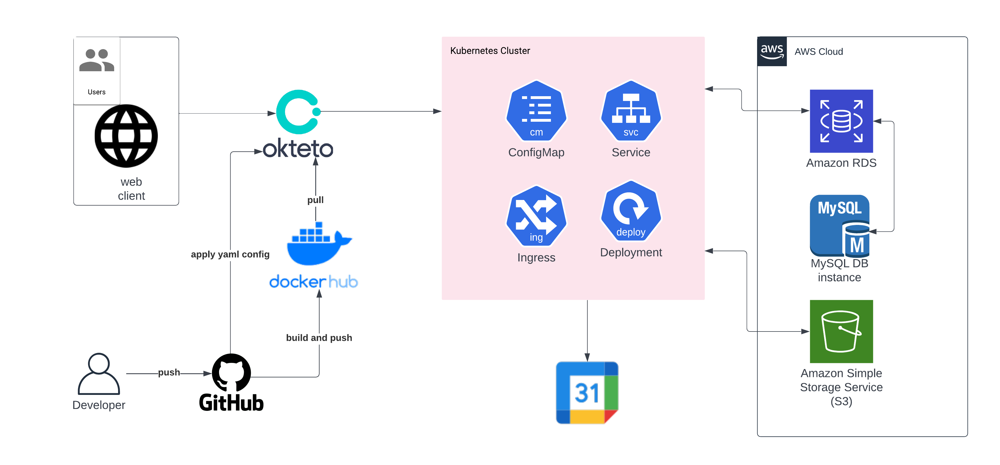

# mrClinic

## Tech Stack

[](https://github.com/labstack/echo)
[](https://pkg.go.dev/gorm.io/gorm?tab=doc)
[](https://github.com/awsdocs/aws-doc-sdk-examples/tree/main/go/example_code/s3)
[](https://github.com/googleapis/google-api-go-client/blob/main/examples/calendar.go)

## About The Project

<p>
  mrClinic is a simple project to help the user as a patient get a medical record realtime, help the user to make an appointment with doctor, and help the doctor organize the medical record.
</p>

[OPEN API](https://app.swaggerhub.com/apis/faliqadlan/mrClinic/1.0.0)

Front-End repository

[Click Here!](https://github.com/MR-Clinic/Frontend)

<details>
<summary>ERD</summary>

</details>
<details>
<summary>HLA</summary>

</details>
<details>
<summary>Doctor</summary>

| Feature Doctor | Endpoint        | Query Param | Request Body         | JWT Token | Utility                               |
| -------------- | --------------- | ----------- | -------------------- | --------- | ------------------------------------- |
| POST           | /login          | -           | indentity & password | NO        | login user with indentity & passwords |
| POST           | /doctor         | -           | \_                   | NO        | register doctor                       |
| PUT            | /doctor         | -           | -                    | YES       | update current doctor profile         |
| DELETE         | /doctor         | -           | -                    | YES       | delete current doctor account         |
| GET            | /doctor/profile | \_          | -                    | YES       | get current doctor profile            |
| GET            | /doctor/all     | -           | -                    | YES       | get all doctor                        |

</details>

<details>
<summary>Patient</summary>

| Feature Patient | Endpoint         | Query Param | Request Body         | JWT Token | Utility                               |
| --------------- | ---------------- | ----------- | -------------------- | --------- | ------------------------------------- |
| POST            | /login           | -           | indentity & password | NO        | login user with indentity & passwords |
| POST            | /patient         | -           | \_                   | NO        | register patient                      |
| DELETE          | /patient         | -           | -                    | YES       | delete current patient account        |
| PUT             | /patient         | -           | -                    | YES       | update current patient profile        |
| GET             | /patient/profile | patient_uid | -                    | YES       | get current patient profile           |

</details>

<details>
<summary>Visit</summary>

| Feature Visit | Endpoint          | Query Param                      | Request Body | JWT Token | Utility              |
| ------------- | ----------------- | -------------------------------- | ------------ | --------- | -------------------- |
| POST          | /Visit            | -                                | \_           | NO        | add visit            |
| PUT           | /Visit/:visit_uid | -                                | -            | YES       | update visit detail  |
| DELETE        | /Visit/:visit_uid | -                                | -            | YES       | delete current visit |
| GET           | /Visit            | kind, uid, status, date, grouped | -            | YES       | get visit            |

</details>
<details>
<summary>Testing</summary>

</details>
<summary>Folder Structure</summary>

</details>

<p align="right">(<a href="#top">back to top</a>)</p>

# How to Use

### 1. install

```bash
git clone https://github.com/MR-Clinic/be.git
```

### 2.1 create file .env

```bash
touch .env
```

### 2.2 open .env

```
nano .env
```

### 2.3 write .env

```bash
PORT=8080
DB=mysql
DB_Name=<database name>
DB_PORT=3306
DB_HOST=localhot
DB_USERNAME=<username>/root
DB_PASSWORD=<password>
DB_LOC=Local
S3_REGION=<reqion AWS S3>/ap-southeast-1
S3_ID=<KEY ID AWS S3>
S3_SECRET=<SECRETKEY AWS S3>
```
### 3.1 create credential folder

```bash
mkdir credential
```

### 3.2 place credential.json

place credential.json for access google calendar API <br> here the reference link
</br>
[Click Here!](https://developers.google.com/workspace/guides/create-credentials#oauth-client-id)

### 3.3 create token folder

```bash
mkdir credential
```

### 3.4 place token.json

place token.json for access google calendar API <br> here the reference link
</br>
[Click Here!](https://github.com/googleworkspace/go-samples/blob/master/calendar/quickstart/quickstart.go)

### 4. run main.go

```bash
go run main.go
```

# Contact

[](https://mail.google.com/)

<p align="right">(<a href="#top">back to top</a>)</p>